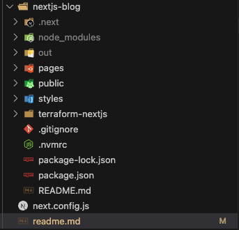

# Client Project Brief

**Scenario Overview**

**Client:** James Smith, a freelance web designer

**Project:** Portfolio Website Deployment

**Project Description:**  James Smith, a freelance web designer, wants to showcase his work and attract potential clients through an online portfolio. He has designed a modern, responsive single-page website using the Next.js framework. James requires this website to be hosted on a robust, scalable, and cost-effective platform. Additionally, the website needs to be highly available and deliver fast loading times for a global audience.

**Your Role:** As a team of cloud engineers, your task is to deploy James's Next.js portfolio website on AWS using Infrastructure as Code (IaC) principles with Terraform. This project will give you hands-on experience with Terraform, S3, and CloudFront, mimicking a real-world deployment scenario.

**Problem Statement**

James needs his portfolio website to be:

**1. Highly Available:** The website should be accessible to users worldwide with minimal downtime.

**2. Scalable:** As his portfolio gains traction, the hosting solution should handle increased traffic without performance degradation.

**3.Cost-Effective:** Hosting costs should be optimized, avoiding unnecessary expenses.

**4. Fast Loading:** The website should load quickly for visitors, providing a seamless user experience.

Given these requirements, deploying the website using AWS services such as S3 for static hosting and CloudFront for content delivery is an ideal solution. Using Terraform will allow you to automate and manage the infrastructure efficiently.

**Project Outcome**

By the end of this project, you should have:

**1. Deployed a Next.js Website:** Successfully deployed the Next.js portfolio site on AWS.

**2. Implemented Infrastructure as Code:** Used Terraform to automate the creation of AWS resources.

**3. Configured Global Content Delivery:** Set up AWS CloudFront to deliver the website content globally with low latency.

**4. Ensured Security and Performance:** Applied best practices for security and performance, ensuring a fast and secure website for James's portfolio.

**5. Deploy everything to github:** Create a github repo and host all your project files and code there.

**Here is the Architecture:**


**Quick Overview of Next.js**

Before we dive into setting up and deploying a Next.js application, let's take a moment to understand what Next.js is, why it's used, and its common use cases. This overview will give you a solid foundation and help you appreciate the capabilities of Next.js.

**What is Next.js?**

Next.js is a popular open-source framework built on top of React, a JavaScript library for building user interfaces. Developed and maintained by Vercel, Next.js provides a robust set of features that enhance the development experience and streamline the process of building web applications.

**Why Use Next.js?**

Next.js is designed to make it easier to create fast, scalable, and SEO-friendly web applications. Here are some key benefits of using Next.js:

1. Server-Side Rendering (SSR): Next.js supports server-side rendering out of the box. This means that web pages are generated on the server for each request, improving initial load times and making the application more SEO-friendly.

2. Static Site Generation (SSG): Next.js allows you to pre-render pages at build time, creating static HTML files. This results in faster load times and improved performance, as static files can be served directly by a CDN.

3. API Routes: Next.js includes a built-in API routing system, allowing you to create serverless functions and API endpoints within the same project. This makes it easy to handle backend logic without needing a separate server.

4. File-Based Routing: Next.js uses a file-based routing system, where the file structure of the pages directory determines the application's routes. This simplifies navigation and routing within the application.

5. Built-In CSS and Sass Support: Next.js supports importing CSS and Sass files, allowing you to style your application easily. It also has built-in support for CSS-in-JS solutions like styled-components.

6. Automatic Code Splitting: Next.js automatically splits your code into smaller chunks, loading only the necessary JavaScript for the current page. This improves load times and overall performance.

**Common Use Cases**

Next.js is versatile and can be used for a variety of web applications. Some common use cases include:

1. Static Websites: Perfect for blogs, landing pages, and portfolio sites where content doesn't change frequently. Static Site Generation (SSG) makes these sites incredibly fast.

2. E-Commerce Sites: Next.js's server-side rendering (SSR) capabilities ensure that product pages load quickly and are optimized for search engines, improving user experience and SEO.

3. Corporate Websites: Companies use Next.js to build scalable, high-performance websites that need to handle large amounts of traffic and provide a seamless user experience.

4. Web Applications: From simple dashboards to complex web apps, Next.js's built-in API routes and server-side rendering capabilities make it a great choice for developing dynamic web applications.

5. Blogs and Content Sites: With Markdown and MDX support, Next.js is ideal for creating content-driven sites that are easy to maintain and SEO-friendly.

**Summary**

Next.js is a powerful framework that extends React's capabilities, making it easier to build fast, scalable, and SEO-friendly web applications. Whether you're creating a static site, a dynamic web app, or an e-commerce platform, Next.js provides the tools and features you need to deliver a great user experience.

Steps:

1. Create a new GitHub repo 

2. Clone the Portfolio Starter Kit:

`npx create-next-app@latest nextjs-blog --use-npm --example "https://github.com/vercel/next-learn/tree/main/basics/learn-starter"`


3. Navigate to the Project Directory:

`cd nextjs-blog`

`npm run dev`


If you, like me, encountered this message, then you will need to update `node` version. I used `homebrew` for this. 

Try tun the following first: `brew upgrade node`. If this will not work, try run the following commands to uninstall the existing Node.js version (if needed):

```
sudo rm -rf /usr/local/lib/node_modules
sudo rm -rf /usr/local/bin/node
sudo rm -rf /usr/local/bin/npm
```

Then run the following: `brew install node` and `node -v` to check that now you are using the correct `node` version.

This should start your next.js app on `http://localhost:3000/`


4. After this in the root of the project folder, create a new file called `next.config.js` and paste the following code inside this file:


5. Run the following command: `npm run build` to create a build of our application to be able to deploy our satic application to `s3`, which would generate an `out` folder, which will be used to deploy our app on Amazon `s3`.


6. Set up Terraform Directory, that should me inside the nextjs blog folder:




7. Set up `state.tf` file, where we will set up out terraform state with s3 and DynamoDB:


8. Create `main.tf` file, where we will put all the s3 configuration inside:


We will set up s3 configuration and also s3 ownership controls to ensure, that we, as s3 bucket owners, have complete control of the objects in the bucket. This will be true even the objects will be uploaded by different aws account

We will also set up public access to the s3 bucket. When the s3 bucket is set up, by default it blocks all the public access to it. Setting up these parameters to `false` allows bucket and objects inside it to be publicly accessible.


No we need to set bucket ACL to public read so the objects in the bucket will be publicly accessible. 
`depends_on` ensures that ownership control and public access block settings are applied before setting the ACL.

Now we need to attach a bucket policy to allow a public read acces to the objects in s3. Bucket policy defines detailed access permissions for the bucket and its objects using IAM policies


These all are refined layers of control for s3 bucket: for fine-grained control, security best practices, compliance, flexibility

